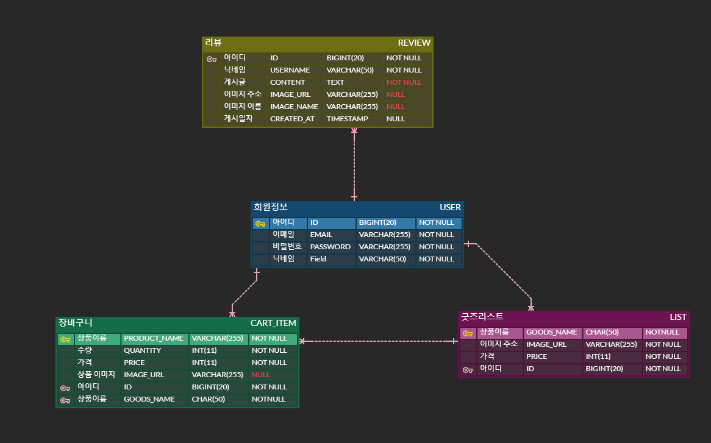
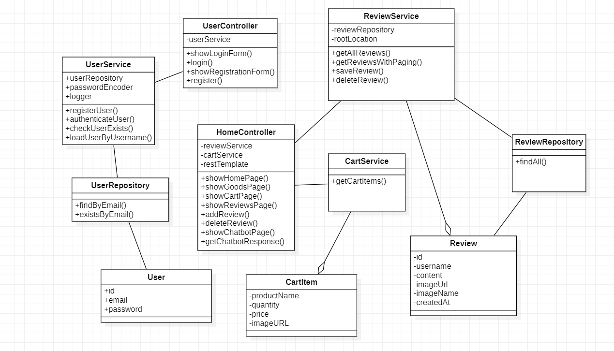
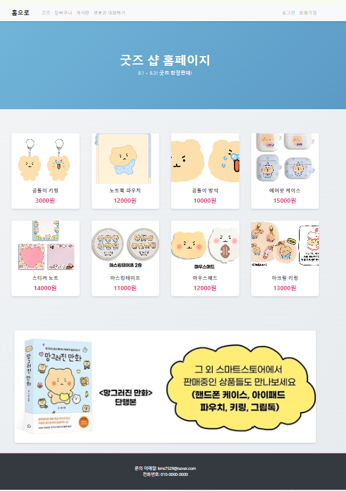
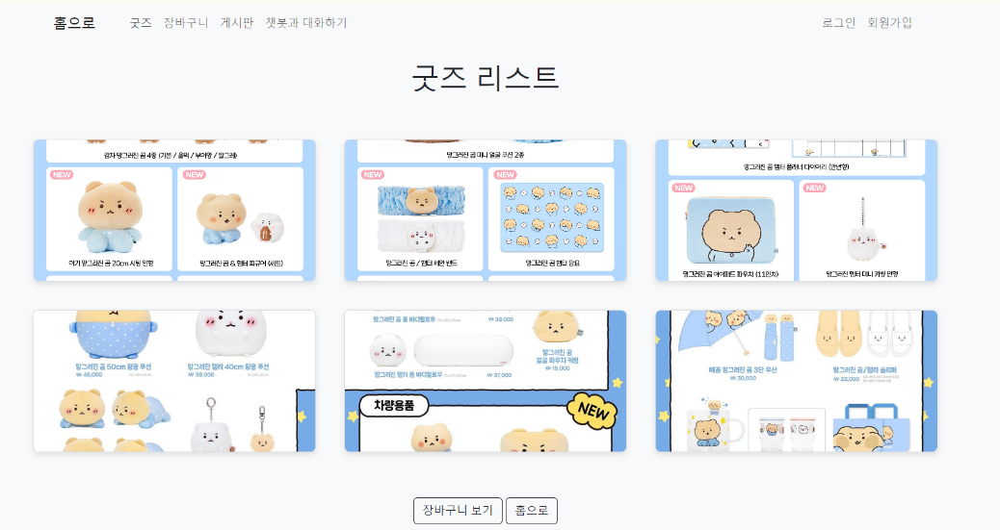
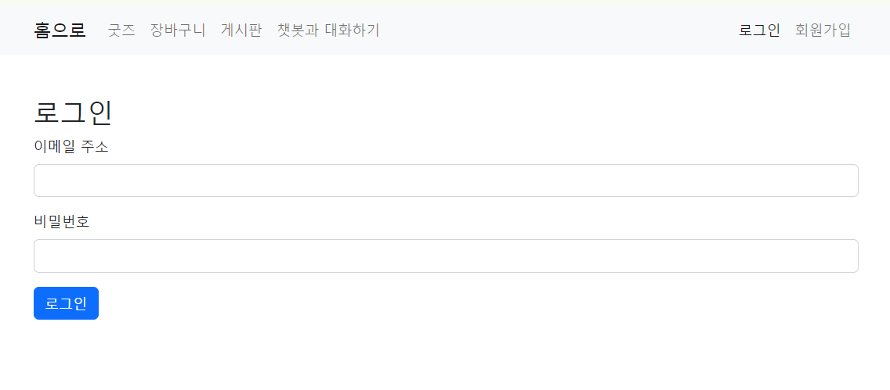
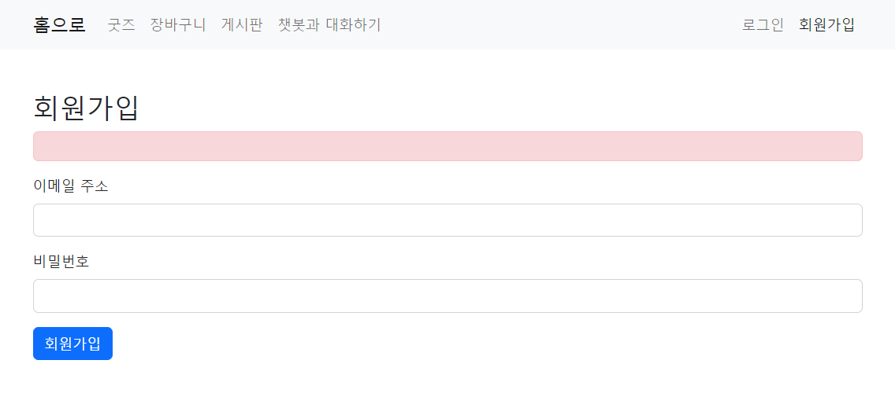
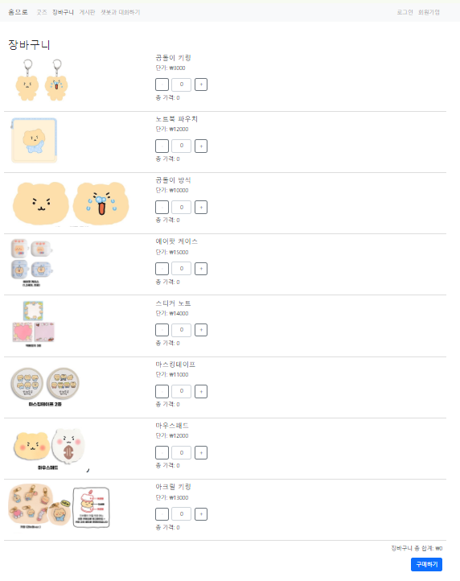
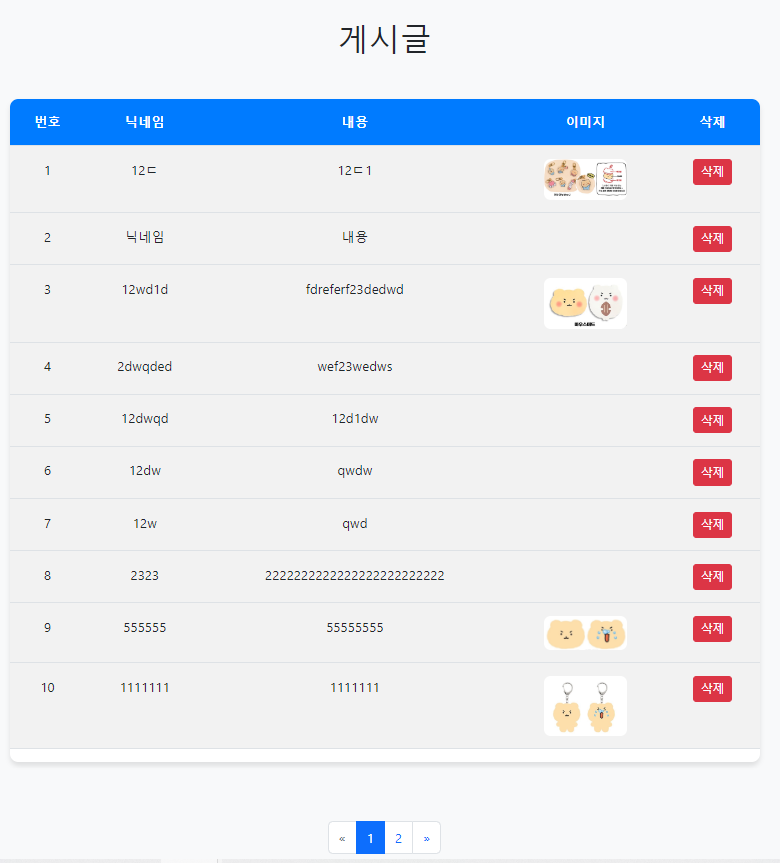
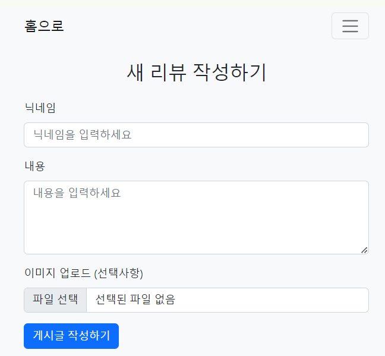
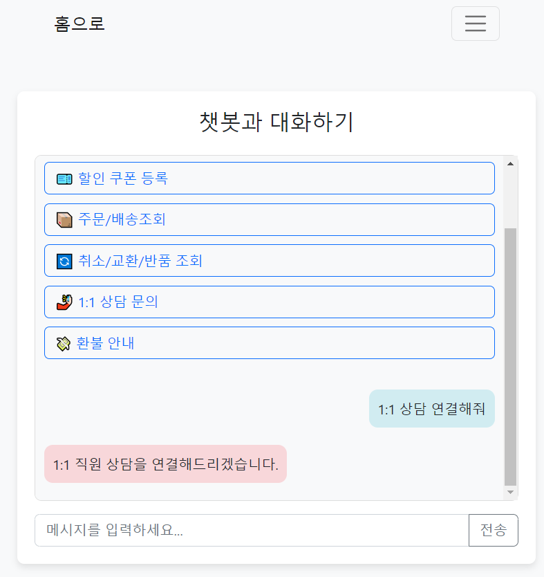

# Goods Shop 웹 프로젝트

대구대학교 AI학과 "웹 프로그래밍" 수업 과제로, 2024년 8월 한 달 동안 혼자 기획하고 만든 Java 웹 쇼핑몰입니다. 카카오톡 이모티콘 캐릭터 굿즈를 파는 사이트를 만들었습니다.

## 기획 의도

좋아하는 카카오톡 이모티콘 굿즈가 오프라인에서만 팔리는 게 아쉬워서, 온라인 판매 사이트를 직접 만들어봤습니다.

## 구현 범위

발표자료 스크린샷 기준으로 실제 동작하던 기능은 이 정도입니다.

- 회원가입 / 로그인 (데이터베이스 연동, 중복 가입 방지)
- 굿즈 리스트 / 홈페이지
- 장바구니 (수량 조절, 합계 자동 계산)
- 게시판 (글 작성/조회/삭제, 페이지네이션)
- 리뷰 작성 (닉네임/내용/이미지 업로드)
- 챗봇 프로토타입 (버튼 기반 FAQ + 1:1 상담 연결, 규칙 기반)

## 설계

**ERD**

REVIEW · USER · CART_ITEM · LIST(굿즈) 4개 테이블 구조. Made by ERDCloud.

**클래스 다이어그램**

`HomeController`가 `ReviewService`·`CartService`를 통해 홈/굿즈/장바구니/
리뷰/챗봇 페이지를 처리하는 MVC 구조. `UserController` + `UserService` +
`UserRepository`로 인증을 분리했습니다.

## 실제 화면

| 홈페이지 | 굿즈 리스트 |
|---|---|
|  |  |

| 로그인 | 회원가입 |
|---|---|
|  |  |

| 장바구니 | 게시판 |
|---|---|
|  |  |

| 리뷰 작성 | 챗봇 |
|---|---|
|  |  |

> 홈페이지 스크린샷 하단에 실제 연락처(이메일)가 그대로 노출되어 있습니다.
> 필요하면 이미지를 잘라내거나 가려서 다시 올려주세요.

## 개발 일정

주제 선정(8/1) → 개발 환경 구축(8/5) → 메인/회원가입(8/8~8/9) → 로그인·게시판
(8/12~8/16) → 챗봇·굿즈 리스트(8/19~8/23) → PPT 및 기능 점검(8/26~8/29) →
발표(8/30)

## 느낀 점 (발표자료 원문)

> 수업으로만 실습하였던 것과는 달리 혼자서 웹사이트를 제작하면서 생각보다
> 막히는 부분들이 많았다. 특히, 초반에 웹서버가 제대로 동작하지 않아 문제를
> 파악하는데 꽤 시간이 걸렸고, 문제를 찾고 해결하는 과정 속에서 더 자세히
> 공부하게 되었던 것 같다. (…) 팀으로 구성하여 역할을 분담하고 프로젝트를
> 개발하는 것이 얼마나 중요한지 깨닫게 되었다.

## 소스 코드에 대해

당시 Java 소스 코드는 따로 백업해두지 않았습니다. 위 ERD, 클래스 다이어그램, 화면 스크린샷은 발표자료에서 그대로 가져온 것입니다.

원본 발표자료: [`데이터 사이언스 웹프로젝트.pptx`](데이터%20사이언스%20웹프로젝트.pptx)
